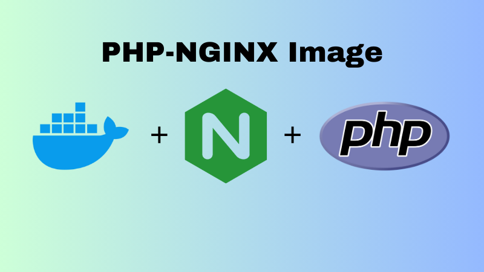

# PHP-NGINX Image

<div align="center">
  
</div>

#### Deploy Your PHP Application In Single Container!

## Gambaran Umum

Docker Image PHP-FPM dengan Nginx Webserver untuk mendeploy aplikasi dengan pemrograman PHP,Konfigurasi image dengan keinginan dan kebutuhan project anda.

## Konfigurasi Image

- File Konfigurasi Virtual Host Nginx (/etc/nginx/conf.d)
- Port PHP-FPM (127.0.0.1:9000)
- Konfigurasi Tersebut dapat di atur dengan Dockerfile / Volume bind di docker-compose

## Prasyarat

Sebelum memulai, pastikan Anda telah memenuhi prasyarat berikut:

- Docker

## Instalasi

Ikuti langkah-langkah di bawah ini untuk mendownload image php-nginx:

1. Download Image

   ```sh
   docker pull ghcr.io/haikalrfadhilah/php-nginx:latest
   ```

## Kontribusi

Jika Anda ingin berkontribusi pada proyek ini,Bisa melalui Pull Request pada repository ini.

## Lisensi

Distributed under the MIT License. Lihat `LICENSE` untuk informasi lebih lanjut.
